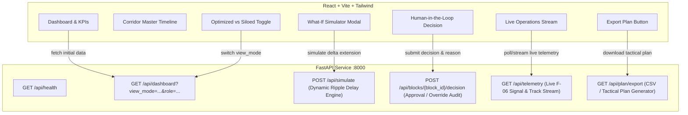

# Full Backend-Frontend Integration Plan for RailSync

This plan outlines the end-to-end integration between the **FastAPI AI Backend** (`backend-ai`) and the **React + TypeScript Cockpit** (`frontend-cockpit`). It replaces static mocks and client-side approximations with real, stateful backend endpoints, dynamic calculation engines, and interactive workflow capabilities.

---

## User Review Required

> [!IMPORTANT]
> The current system has a proxy configured (`/api` -> `http://127.0.0.1:8000`), but several UI actions (approval/override decisions, plan export, telemetry stream, and optimization switching) were previously mocked or simulated only in client-side React state.
> This integration connects every button, modal, and stream in the frontend to live FastAPI endpoints.

---

## Architecture & Integration Scope



---

## Proposed Changes

### Backend AI (`backend-ai/main.py`)

#### [MODIFY] [`backend-ai/main.py`](file:///c:/Users/Aniruddha%20Paul/OneDrive/Desktop/SIH2026/rail-sih/backend-ai/main.py)
1. **Stateful Data Store**:
   - Maintain in-memory blocks, trains, alerts, and telemetry logs with helper reset/query methods.
2. **Dynamic What-If Simulation Algorithm**:
   - Replace static response with a dynamic network ripple calculation:
     - Parse scheduled end vs. new end time.
     - Compute duration extension in minutes.
     - Calculate downstream passenger train delays based on trains scheduled in the corridor window.
     - Calculate freight regulations (held rakes) and punctuality percentage drop.
     - Generate dynamic, contextual conflict warnings with train IDs and section tags.
3. **Block Decision Endpoint**:
   - `POST /api/blocks/{block_id}/decision`: Accept `{ decision: "approved" | "rejected", reason?: string, operator_role?: string }`.
   - Update block status and audit log, resolve or update associated conflict alerts.
4. **Backend-Driven Siloed vs Optimized Plan Generation**:
   - Support query parameter `view_mode=optimized` (default) vs `view_mode=siloed`.
   - In `siloed` mode, generate the uncoordinated multi-department departmental requests with higher conflict counts, lower block hour savings, and active alerts.
   - In `optimized` mode, generate the harmonized multi-department consolidated window with explainability metrics.
5. **Live Operations Telemetry Endpoint**:
   - `GET /api/telemetry`: Return live sequence of telemetry events (e.g., F-06 signal statuses, track circuit occupancy, OHE power isolations, speed restrictions).
6. **Plan Export Endpoint**:
   - `GET /api/plan/export`: Return structured CSV or formatted JSON export for download by railway dispatchers.

---

### Frontend Cockpit (`frontend-cockpit/src/`)

#### [MODIFY] [`frontend-cockpit/src/types/index.ts`](file:///c:/Users/Aniruddha%20Paul/OneDrive/Desktop/SIH2026/rail-sih/frontend-cockpit/src/types/index.ts)
- Add types for `BlockDecisionRequest`, `BlockDecisionResponse`, and `TelemetryEvent`.

#### [MODIFY] [`frontend-cockpit/src/services/simulationService.ts`](file:///c:/Users/Aniruddha%20Paul/OneDrive/Desktop/SIH2026/rail-sih/frontend-cockpit/src/services/simulationService.ts)
- Add `getDashboard(viewMode?: string, role?: string): Promise<DashboardData>`
- Add `submitBlockDecision(blockId: string, decision: 'approved' | 'rejected', reason?: string): Promise<Block>`
- Add `getTelemetry(): Promise<TelemetryEvent[]>`
- Add `exportPlanUrl(): string` (or blob download trigger)

#### [MODIFY] [`frontend-cockpit/src/App.tsx`](file:///c:/Users/Aniruddha%20Paul/OneDrive/Desktop/SIH2026/rail-sih/frontend-cockpit/src/App.tsx)
- Connect **Human-in-the-Loop Approval & Reject/Override** buttons to `simulationService.submitBlockDecision`, updating the block in the state and dashboard in real-time.
- Update **View Mode Toggle** (`Optimized` vs `Siloed`) to re-query the backend with the desired mode.
- Connect **Live Operations Stream** to periodically poll `/api/telemetry` and display real-time animated event log items.
- Connect **Export Plan** button to download the tactical schedule directly.

---

## Verification Plan

### Automated & API Verification
- Test all new FastAPI endpoints with automated requests:
  - `GET /api/health`
  - `GET /api/dashboard?view_mode=optimized`
  - `GET /api/dashboard?view_mode=siloed`
  - `POST /api/simulate` with varying time extensions (e.g., +30m, +120m, +0m) to ensure dynamic calculation works properly
  - `POST /api/blocks/BLK-2026-W36-004/decision` with approval and rejection payloads
  - `GET /api/telemetry`
  - `GET /api/plan/export`
- Run TypeScript check and production build:
  ```powershell
  cd frontend-cockpit
  npm.cmd run build
  ```

### Manual & Interactive Verification
- Open `http://localhost:5173` in the browser:
  - Verify `LIVE` status pill in header.
  - Switch between **AI Optimized** and **Manual/Siloed Plan** and observe timeline and KPIs updating from the backend.
  - Open block details modal for `BLK-2026-W36-004`:
    - Extend end time from `05:00` to `06:30` and click "Run Simulation" — verify calculated passenger delay and conflict list.
    - Enter override reason and click "Approve" or "Reject / Override" — verify state updates in modal and on the dashboard.
  - Watch the **Live Operations Stream** card render real telemetry events.
  - Click **Export Plan** and verify a schedule file is downloaded.
